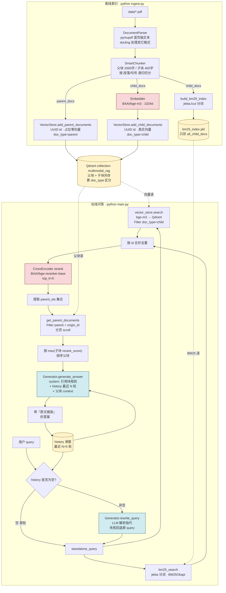

# 系统架构

## 全流程图



## ASCII 兜底版

```
═══════════════════ 离线索引 (python ingest.py) ═══════════════════

  data/*.pdf
      │
      ▼
  DocumentParser ──── pymupdf 抽文本 / docling 兜底
      │
      ▼
  SmartChunker ──── 父块 2000字 + 子块 400字 (递归切分)
      │
      ├─ parent_docs ─────────────────────────┐
      │                                        │
      └─ child_docs ─┬─► Embedder (bge-m3) ──┐ │
                     │                        │ │
                     ▼                        ▼ ▼
                   build_bm25       ┌─────────────────────────┐
                   (jieba)          │   Qdrant collection     │
                     │              │   "multimodal_rag"      │
                     ▼              │  ─────────────────────  │
                bm25_index.pkl      │  父块: 占位零向量        │
              (只存 all_child_docs) │  子块: 真实向量          │
                                    │  doc_type 区分           │
                                    │  point id = UUID         │
                                    └─────────────────────────┘

═══════════════════ 在线问答 (python main.py) ═══════════════════

  用户 query                history (滑窗 N=5 轮)
       └────────┬───────────────────┘
                ▼
        rewrite_query (LLM)         首轮跳过 / 失败回退原 query
                │
        standalone_query
                │
        ┌───────┴───────┐
        ▼               ▼
   bm25_search    vector.search
   (jieba+BM25)   (bge-m3+Qdrant,
                   Filter doc_type=child)
        │               │
        └───── 合并去重 ─┘
                │
                ▼
        CrossEncoder rerank ──── bge-reranker-base, top_k=5
                │
                ▼
        取 parent_ids → get_parent_documents
        (Filter parent + origin_id, 分页 scroll)
                │
                ▼
        按 max(子块 rerank_score) 排序
                │
                ▼
        generate_answer (LLM)
        ┌─────────────────────────────┐
        │ system: 引用块规则           │
        │ history: 最近 N 轮 user/asst │
        │ user: query + 父块 context   │
        └─────────────────────────────┘
                │
                ▼
      带『原文摘录』的答案 ──► 写回 history → 滑窗裁剪
```

## 组件 / 文件 / 职责对照

| 层 | 组件 | 文件 | 关键职责 |
|---|---|---|---|
| 解析 | `DocumentParser` | `src/document_parser.py` | PDF 用 pymupdf 逐页抽文，其它格式走 docling |
| 切块 | `SmartChunker` | `src/chunker.py` | 父块 2000 字 / 子块 400 字，按段落/句号递归切 |
| 向量化 | `Embedder` | `src/embedder.py` | `BAAI/bge-m3`，1024 维，归一化 |
| 存储 | `VectorStore` | `src/vector_store.py` | Qdrant 单 collection 装父子两类点；UUID id；服务端 Filter |
| BM25 | `_tokenize` + `build_bm25_index` | `src/retriever.py` | jieba 分词 + `BM25Okapi`；pkl 只存子块文档 |
| 召回 | `hybrid_search` | `src/retriever.py` | BM25 + 向量各取 top_k，按 id 合并去重 |
| 精排 | CrossEncoder | `src/retriever.py` | `BAAI/bge-reranker-base`，top_k=5 |
| 父块展开 | `get_parent_documents` | `src/vector_store.py` | 按 parent_id 拉父块，按子块 max 分排序 |
| 改写 | `rewrite_query` | `src/generator.py` | LLM 解析指代，失败回退原 query |
| 生成 | `generate_answer` | `src/generator.py` | system 强制引用块规则；history + 父块 context |
| 编排 | `main()` | `main.py` | 滑动窗口 history、`reset` / `quit` 指令 |
| 配置 | `Settings` | `src/config.py` | pydantic-settings 读 `.env` |

## 关键设计点

- **父子分块**：检索粒度小（子块向量更聚焦命中），喂 LLM 粒度大（父块上下文完整）。靠 `parent_id` 反查。
- **单 collection 共存**：减少一套存储。代价是父块得占位零向量，召回时**必须服务端 Filter `doc_type=child`**，否则零向量挤占 top_k。
- **混合检索互补**：BM25 抓精确词（专有名词、缩写），向量抓语义（同义改写）。中文 BM25 必须 jieba 分词，否则 `query.split()` 把整句当一个 token，BM25 失效。
- **改写 vs 记忆分两层**：rewrite 解决检索时的指代消解，history 解决答案语气连贯。两件事不要混在一个 prompt 里。
- **滑动窗口**：简单可控，不引入额外 LLM 调用做 summary。窗口长度可在 `config.py` 调。
