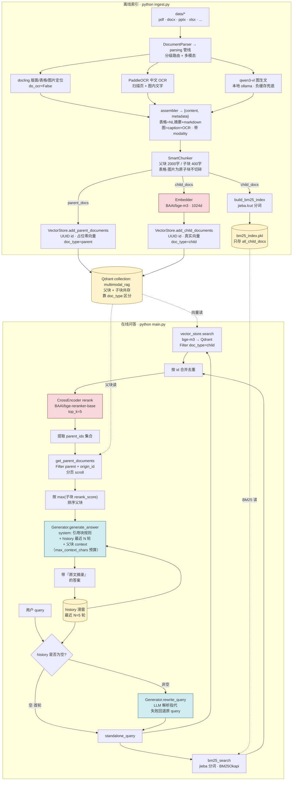

# 系统架构

## 全流程图



## ASCII 兜底版

```
═══════════════════ 离线索引 (python ingest.py) ═══════════════════

  data/*  (pdf · docx · pptx · xlsx · ...)
      │
      ▼
  DocumentParser → parsing 分级管线
      │   ├─ docling     版面/表格/图片定位 (do_ocr=False)
      │   ├─ PaddleOCR   扫描页 + 图内中文文字
      │   └─ qwen3-vl    图生文 (本地 ollama, 失败负缓存)
      │            │
      │            ▼
      │   assembler → {content, metadata}
      │     表格 = NL摘要 + markdown原表 ; 图 = caption + OCR
      │     metadata 带 modality / page / bbox / element_id
      ▼
  SmartChunker ──── 父块 2000字 + 子块 400字 (递归切分)
      │             表格/图片为原子块, 不切碎
      │
      ├─ parent_docs ─────────────────────────┐
      │                                        │
      └─ child_docs ─┬─► Embedder (bge-m3) ──┐ │
                     │                        │ │
                     ▼                        ▼ ▼
                   build_bm25       ┌─────────────────────────┐
                   (jieba)          │   Qdrant collection     │
                     │              │   "multimodal_rag"      │
                     ▼              │  ─────────────────────  │
                bm25_index.pkl      │  父块: 占位零向量        │
              (只存 all_child_docs) │  子块: 真实向量          │
                                    │  doc_type 区分           │
                                    │  point id = UUID         │
                                    └─────────────────────────┘

═══════════════════ 在线问答 (python main.py) ═══════════════════

  用户 query                history (滑窗 N=5 轮)
       └────────┬───────────────────┘
                ▼
        rewrite_query (LLM)         首轮跳过 / 失败回退原 query
                │
        standalone_query
                │
        ┌───────┴───────┐
        ▼               ▼
   bm25_search    vector.search
   (jieba+BM25)   (bge-m3+Qdrant,
                   Filter doc_type=child)
        │               │
        └───── 合并去重 ─┘
                │
                ▼
        CrossEncoder rerank ──── bge-reranker-base, top_k=5
                │
                ▼
        取 parent_ids → get_parent_documents
        (Filter parent + origin_id, 分页 scroll)
                │
                ▼
        按 max(子块 rerank_score) 排序
                │
                ▼
        generate_answer (LLM)
        ┌─────────────────────────────┐
        │ system: 引用块规则           │
        │ history: 最近 N 轮 user/asst │
        │ user: query + 父块 context   │
        └─────────────────────────────┘
                │
                ▼
      带『原文摘录』的答案 ──► 写回 history → 滑窗裁剪
```

## 组件 / 文件 / 职责对照

| 层 | 组件 | 文件 | 关键职责 |
|---|---|---|---|
| 解析·路由 | `parse` / `_enrich` | `src/parsing/router.py` | 分级路由：PDF 按文本覆盖率分流；扫描页走 OCR；图片走 VLM+OCR；docling 失败回退 PyMuPDF |
| 解析·版面 | `docling_backend` | `src/parsing/docling_backend.py` | docling 抽文本/表格/图片，`do_ocr=False`，bbox/页码来自 `prov` |
| 解析·OCR | `ocr_paddle` | `src/parsing/ocr_paddle.py` | PaddleOCR 中文（替换 docling 默认 EasyOCR），`enable_mkldnn=False`，按坐标重排阅读序 |
| 解析·图生文 | `vision` | `src/parsing/vision.py` | 本地 ollama qwen3-vl 描述图片；`max_tokens≥1500`；失败写 TTL 负缓存 |
| 解析·表格 | `tables` | `src/parsing/tables.py` | markdown 原表 + LLM 生成 NL 摘要双存 |
| 解析·归一 | `assembler` / `Element` | `src/parsing/assembler.py` · `models.py` | Element[] → `{content, metadata}`；带 modality/page/bbox |
| 解析·缓存 | `ParseCache` | `src/parsing/cache.py` | 内容哈希缓存 OCR/VLM；`is_fresh` 支持 TTL 负缓存 |
| 入口 | `DocumentParser` | `src/document_parser.py` | 转调 parsing 管线，返回 `{content, metadata}`（契约不变） |
| 切块 | `SmartChunker` | `src/chunker.py` | 父块 2000 字 / 子块 400 字；表格·图片为原子块不切碎 |
| 向量化 | `Embedder` | `src/embedder.py` | `BAAI/bge-m3`，1024 维，归一化 |
| 存储 | `VectorStore` | `src/vector_store.py` | Qdrant 单 collection 装父子两类点；UUID id；服务端 Filter |
| BM25 | `_tokenize` + `build_bm25_index` | `src/retriever.py` | jieba 分词 + `BM25Okapi`；pkl 只存子块文档 |
| 召回 | `hybrid_search` | `src/retriever.py` | BM25 + 向量各取 top_k，按 id 合并去重 |
| 精排 | CrossEncoder | `src/retriever.py` | `BAAI/bge-reranker-base`，top_k=5 |
| 父块展开 | `get_parent_documents` | `src/vector_store.py` | 按 parent_id 拉父块，按子块 max 分排序 |
| 改写 | `rewrite_query` | `src/generator.py` | LLM 解析指代，失败回退原 query |
| 生成 | `generate_answer` | `src/generator.py` | system 强制引用块规则；history + 父块 context；按 `max_context_chars` 截断 |
| 编排 | `main()` | `main.py` | 滑动窗口 history、`reset` / `quit` 指令 |
| 配置 | `Settings` | `src/config.py` | pydantic-settings 读 `.env` |

## 关键设计点

- **多模态解析是地基**：检索质量的天花板 = 解析质量。图片/表格/扫描页都先"翻译"成高质量可检索文本，喂进统一的 `{content, metadata}` 契约，下游切块/向量/存储零改动。
- **分级路由，成本/延迟感知**：不无脑全量 OCR/VLM。PDF 按文本覆盖率分流——有文本层的页直接抽（docling `do_ocr=False`），扫描页才渲染整页交 PaddleOCR；图片才过 VLM。
- **主动替换默认 OCR 引擎**：docling 默认 EasyOCR 中文偏弱，改用 PaddleOCR（PP-OCRv5）。CPU 版 paddle 默认 oneDNN 会崩，须 `enable_mkldnn=False`。
- **图片双通道**：VLM（本地 ollama qwen3-vl）出语义描述 + PaddleOCR 出图内文字，合并入库。qwen3 思考模式吃 token，`max_tokens` 须 ≥1500 否则正文为空。
- **表格双存**：markdown 原表喂 LLM（精确读数），LLM 生成的 NL 摘要进向量库（解决"裸表向量召回不敏感"）。表格/图片在切块时作为原子块，不被递归切分切碎。
- **降级链，绝不静默丢**：docling 失败→PyMuPDF 纯文本；VLM 失败→仅 OCR；OCR 也空→占位但保留 bbox 溯源。VLM 临时故障写 TTL 负缓存，窗口内跳过、过期重试。
- **解析缓存**：OCR/VLM 结果按内容哈希存 `.parse_cache/`，重复 ingest 不重算（VLM 还省本地算力）。
- **上下文预算**：父块按相关度降序填入 context，到 `max_context_chars` 即停、末块截断，避免多个父块叠加超出 LLM 的 prompt token 上限。
- **父子分块**：检索粒度小（子块向量更聚焦命中），喂 LLM 粒度大（父块上下文完整）。靠 `parent_id` 反查。
- **单 collection 共存**：减少一套存储。代价是父块得占位零向量，召回时**必须服务端 Filter `doc_type=child`**，否则零向量挤占 top_k。
- **混合检索互补**：BM25 抓精确词（专有名词、缩写），向量抓语义（同义改写）。中文 BM25 必须 jieba 分词，否则 `query.split()` 把整句当一个 token，BM25 失效。
- **改写 vs 记忆分两层**：rewrite 解决检索时的指代消解，history 解决答案语气连贯。两件事不要混在一个 prompt 里。
- **滑动窗口**：简单可控，不引入额外 LLM 调用做 summary。窗口长度可在 `config.py` 调。
